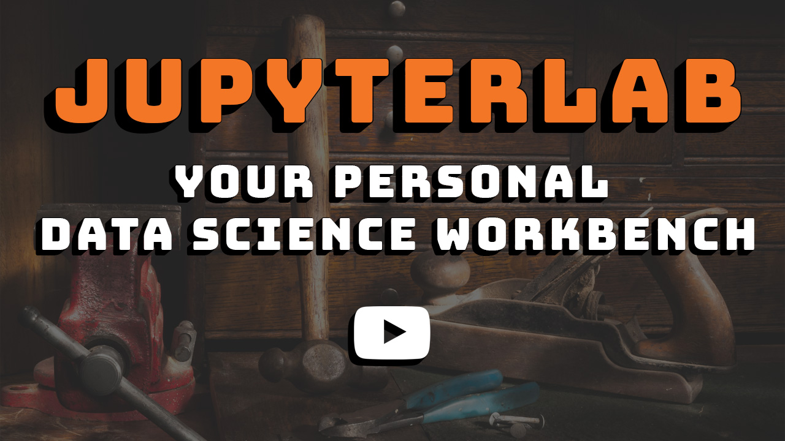

# JupyterLab - Your Personal Data Science Workbench

These are the materials for the [March 2018 presentation](https://skillsmatter.com/skillscasts/11613-jupyterlab-your-personal-data-science-workbench) at [Full Stack Quants](http://fullstackquants.org/), London:

 * [**Presentation Slides**](https://rawgit.com/markusschanta/talks/master/2018-03%20-%20JupyterLab%20-%20Full%20Stack%20Quants/presentation.html)
 * [Example Notebooks](https://github.com/markusschanta/talks/tree/master/2018-03%20-%20JupyterLab%20-%20Full%20Stack%20Quants/notebooks) (available as interactive notebooks via [binder](https://mybinder.org/v2/gh/markusschanta/talks/master?urlpath=lab/tree/2018-03%20-%20JupyterLab%20-%20Full%20Stack%20Quants/notebooks))
 * [Setup Instructions](https://github.com/markusschanta/talks/blob/master/2018-03%20-%20JupyterLab%20-%20Full%20Stack%20Quants/setup.md)

## Further Resources

 * [jupyter/docker-stacks](https://github.com/jupyter/docker-stacks) - Stacks of ready-to-run Jupyter applications in Docker.
 * [jupyter.org](http://jupyter.org/) - Jupyter website.
 * [Jupyter Awesome List](https://github.com/markusschanta/awesome-jupyter) - A curated list of awesome Jupyter projects, libraries and resources.
 * [JupyterCon](https://conferences.oreilly.com/jupyter/jup-ny) - The official Jupyter conference (Aug 21-24 2018, New York).
