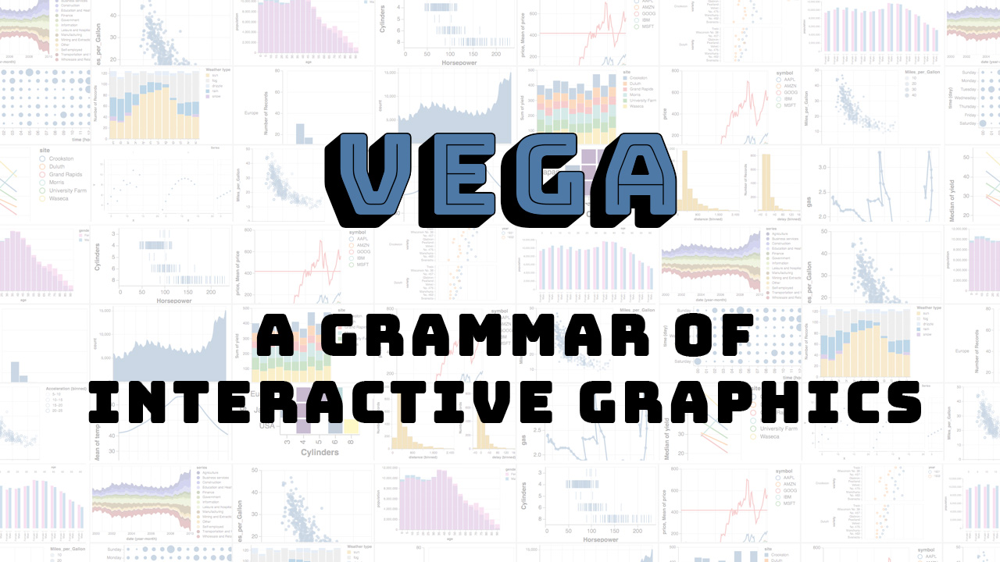

# Vega – A Grammar of Interactive Graphics

This presentation, given in July 2018 at  [Full Stack Quants](http://fullstackquants.org/) London, provides an overview of Vega, a framework for interactive visualisation. The talk includes a step-by-step tutorial for creating production-quality visualisations as well as an overview of related libraries and tools that you can use to create plots more easily.

The talk does not require extensive knowledge of Javascript or Python. It aims to provide useful information for beginners as well as people who are already  familiar with these visualisation frameworks.

Below are links to the accompanying materials:

 * [**Presentation Slides**](https://rawgit.com/markusschanta/talks/master/2018-07%20-%20Vega%20-%20Full%20Stack%20Quants/presentation/presentation.html)
 * [**Presentation Recording**](https://skillsmatter.com/skillscasts/12257-vega-a-grammar-of-interactive-graphics)
 * [Example Visualisations](https://github.com/markusschanta/talks/tree/master/2018-07%20-%20Vega%20-%20Full%20Stack%20Quants/presentation)
 
## Further Resources

 * [Vega-Lite Example Gallery](https://vega.github.io/vega-lite/examples/)
 * [Vega](https://vega.github.io/vega/docs/) / [Vega-Lite](https://vega.github.io/vega-lite/docs/) Documentation
 * [Vega/Vega-Lite Editor](https://vega.github.io/editor/)
 * [Voyager](http://vega.github.io/voyager/)
